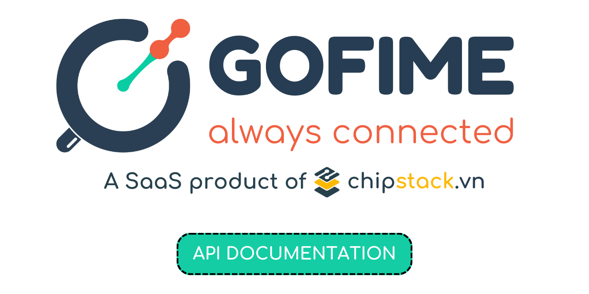

<p align="center">
  
</p>

### GOFIME API V1
------

### 1. Resources

In version V1, there are 4 resources which are:

- `User`: User information
- `Devices`: Gofime devices 
- `Safezones`: Safezones of each device
- `Locations`: Locations of each device

### 2. Routes and endpoints

| Routes                                                       |        GET         |        POST        | PUT  |       DELETE       |       PATCH        |
| ------------------------------------------------------------ | :----------------: | :----------------: | :--: | :----------------: | :----------------: |
| :link: [/v1/user](user.md)                                      | :heavy_check_mark: |                    |      |                    |                    |
| :link: [/v1/devices](devices.md)                                | :heavy_check_mark: | :heavy_check_mark: |      |                    |                    |
| :link: [/v1/devices/{device_id}](device.md)                     | :heavy_check_mark: |                    |      | :heavy_check_mark: | :heavy_check_mark: |
| :link: [/v1/devices/{device_id}/locations](locations.md)        | :heavy_check_mark: |                    |      |                    |                    |
| :link: [/v1/devices/{device_id}/safezones](safezones.md)        | :heavy_check_mark: |  |      |                    |                    |
| :link: [/v1/devices/{device_id}/safezones/{safezone_id}](safezone.md) | :heavy_check_mark: |                    |      | :heavy_check_mark: | :heavy_check_mark: |


### 3. Status code

| Code |        Name         |                   Description                   |
| :--: | :-----------------: | :---------------------------------------------: |
| 200  |         OK          |                     Success                     |
| 400  |     BAD_REQUEST     |               Invalid parameters                |
| 401  |    UNAUTHORIZED     |             Client is unauthorized              |
| 403  |      FORBIDDEN      | Client is blocked and forbidden in all services |
| 404  |      NOT_FOUND      |                URL is not found                 |
| 405  | METHOD_NOT_ALLOWED  |              Method is not allowed              |
| 408  |   REQUEST_TIMEOUT   |                 Request timeout                 |
| 409  |      CONFLICT       |      Same type request is processed before      |
| 429  |  TOO_MANY_REQUEST   |                Too many request                 |
| 460  | TRANSACTION_FAILURE |    Transaction failure<br>Device is offline     |
| 500  | INTERNAL_SERVER_ERROR |             Internal server errors              |
| 503  | SERVICE_UNAVAILABLE |             Service is unavailable              |

**Response content type:** application/json

**Response format example:**

```
{
	"status": {
		"code": 405,
		"name": "METHOD_NOT_ALLOWED",
		"message": "Method is not allowed",
		"additional_message": ""
	},
	"doclink": "https://github.com/Chipstack/gofime-api-documents"
}
```

### 4. API Quota
Below is default configured API Quota. The limit can be extended by your demand. Contact us for more information.
- 10 requests per minute
- 1600 requests per day


